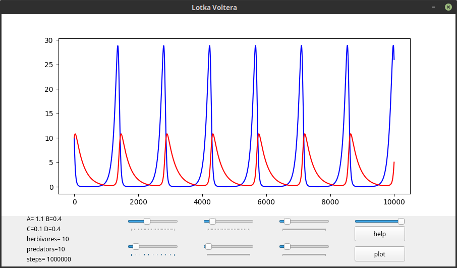

Project simulating populaton of predators and prey using Lotka-Volterra
equations.

Interface:

Parameters description:
"A" – herbivore growth rate,
"B" – herbivore death rate (predator caused)
"C" – predator growth rate,
"D" – predator death rate,
perdators – starting amount of predators,
herbivores – starting amount of prey,
steps – steps of calculation

Moving sliders automaticly calculates graph for 50000 steps.
"plot" button calculates graph for amount of steps stated by "steps"
parameter 
